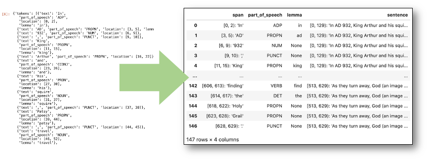
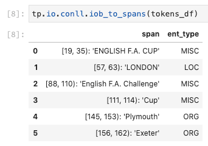
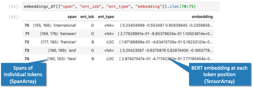
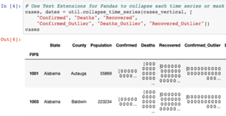
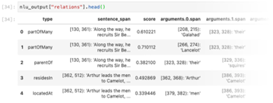
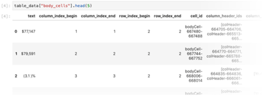
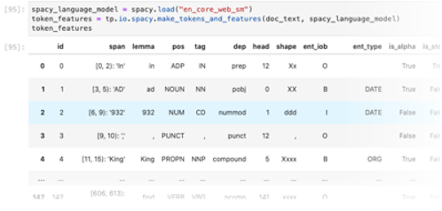
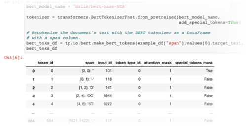

<!-- Front page of Github pages web site -->

# Text Extensions for Pandas

Make NLP data easier to understand with Pandas DataFrames.



Text Extensions for Pandas lets you use Pandas DataFrames for representing and manipulating the complex data structures that flow through
modern natural language processing (NLP) applications.

We provide **Pandas extension types** to cover common data structures for representing natural language data, plus **library integrations** that turn the outputs of popular NLP libraries into easy-to-understand DataFrames.

Want to try it out? Use the following command to install:

```
pip install text-extensions-for-pandas
```

Then take a look at our [introductory Jupyter notebook](https://nbviewer.jupyter.org/github/CODAIT/text-extensions-for-pandas/blob/master/notebooks/Text_Extensions_for_Pandas_Overview.ipynb)
and our [API documentation](https://text-extensions-for-pandas.readthedocs.io/en/latest/).


# Extension Types

We extend the [Pandas data model](https://pandas.pydata.org/pandas-docs/stable/user_guide/basics.html#basics-dtypes) with two new concepts: **Spans** and **Tensors**

We use the Pandas [extensions API](https://pandas.pydata.org/pandas-docs/stable/development/extending.html#extension-types) to integrate our NLP data types tightly with the rest of Pandas DataFrames.

## Spans and SpanArrays

A *span* is a range of characters or tokens within a document. Our
**SpanArray** extension for Pandas lets you store spans in a column
of a Pandas DataFrame. So you can use SpanArrays to build a DataFrame of token features...


...and then pivot those token features into a DataFrame of entity spans:


Behind the scenes, we represent the spans efficiently using Numpy arrays.

SpanArrays work with Jupyter notebooks. So if you have a column in your Pandas
DataFrame with, say, the person names in your document, you can
visualize those locations with one line of code:


To learn more about the SpanArray extension type,
[take a look at our demo notebook](https://nbviewer.jupyter.org/github/CODAIT/text-extensions-for-pandas/blob/master/notebooks/Text_Extensions_for_Pandas_Overview.ipynb#SpanArray).


## Tensors and TensorArrays

A *tensor* is an n-dimensional array of numbers or strings. Our **TensorArray**
extension lets you store a tensor in each cell of a Pandas DataFrame.  Behind
the scenes, we represent the entire series of tensors efficiently using a
single Numpy array. 

So you can give your DataFrame a column of BERT embeddings...



...or store a time series in each cell of your DataFrame:



(Example from the [covid-notebooks project](https://nbviewer.jupyter.org/github/CODAIT/covid-notebooks/blob/master/notebooks/timeseries_us_data.ipynb))

To learn more about the TensorArray extension type,
[take a look at our demo notebook](https://nbviewer.jupyter.org/github/CODAIT/text-extensions-for-pandas/blob/master/notebooks/Text_Extensions_for_Pandas_Overview.ipynb#TensorArray).

# Library Integrations

Text Extensions for Pandas includes DataFrame integrations with popular NLP libraries. These DataFrames make each library's output easier to understand, 
and they make it *much* easier to [use multiple libraries in the same application](https://nbviewer.jupyter.org/github/CODAIT/text-extensions-for-pandas/blob/master/notebooks/Integrate_NLP_Libraries.ipynb).

If you would like to add additional support for your own NLP library, we welcome contributions to the project! See our [README file](https://github.com/CODAIT/text-extensions-for-pandas#contributing) for information on how to contribute.  <!-- TODO: add link to CONTRIBUTING.md file when we have one. -->

## IBM Watson Natural Language Understanding

Text Extensions for Pandas can convert the output of [IBM Watson Natural Language Understanding](https://www.ibm.com/cloud/watson-natural-language-understanding) to Pandas DataFrames. For example, here's the output of the "Relations" analysis as a DataFrame:



To learn more about our Watson Natural Language Understanding integration, 
[take a look at our demo notebook](https://nbviewer.jupyter.org/github/CODAIT/text-extensions-for-pandas/blob/master/notebooks/Analyze_Text.ipynb).

## IBM Watson Discovery Table Understanding

Text Extensions for Pandas can convert the output of [IBM Watson Discovery](https://www.ibm.com/cloud/watson-discovery)'s [Table Understanding enrichment](https://cloud.ibm.com/docs/discovery-data?topic=discovery-data-understanding_tables) to Pandas DataFrames.

You can generate a DataFrame of low-level table components...



...or even reconstruct the tables from your PDF or HTML documents as live Pandas DataFrames:


To learn more about our Watson Discovery Table Understanding integration, 
[take a look at our demo notebook](https://nbviewer.jupyter.org/github/CODAIT/text-extensions-for-pandas/blob/master/notebooks/Analyze_Text.ipynb).


## SpaCy

Text Extensions for Pandas can convert the outputs of a [SpaCy](https://spacy.io/) language model into Pandas DataFrames. Supported natural language features include tokens, sentence boundaries, part of speech tags, named entities, and dependency parse trees.



To learn more about our SpaCy integration, 
[take a look at our demo notebook](https://nbviewer.jupyter.org/github/CODAIT/text-extensions-for-pandas/blob/master/notebooks/Integrate_NLP_Libraries.ipynb#Extract-Additional-Features-with-SpaCy-).


## Transformers

Text Extensions for Pandas integrates with the Huggingface [`transformers`](https://github.com/huggingface/transformers) library.

So you can quickly generate a DataFrame of [SentencePiece](https://github.com/google/sentencepiece) tokens for a BERT language model...



...and then generate [BERT embeddings](https://en.wikipedia.org/wiki/BERT_(language_model)) for each token position:


Then you can use Pandas DataFrames to train a model over your embeddings and to align the outputs of the model with your corpus's original tokenization. To learn more, 
[take a look at our demo notebook](https://nbviewer.jupyter.org/github/CODAIT/text-extensions-for-pandas/blob/master/notebooks/Model_Training_with_BERT.ipynb).


